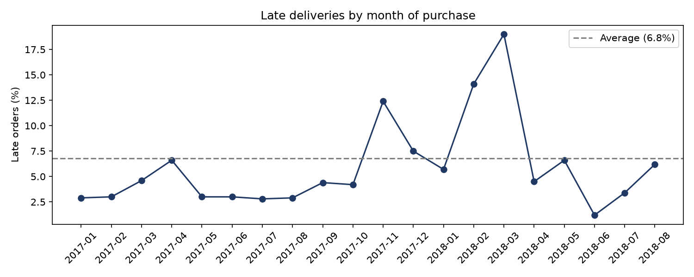
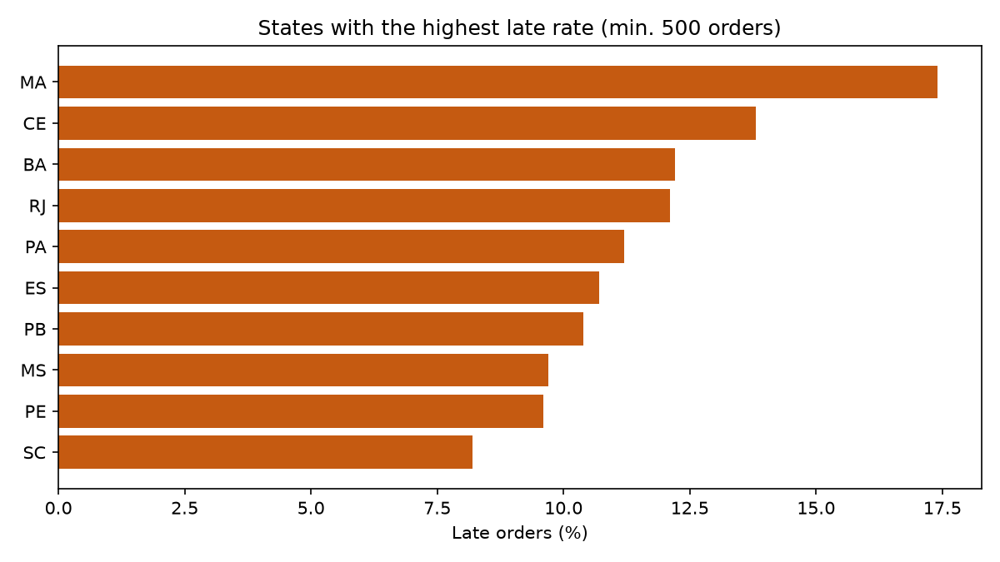
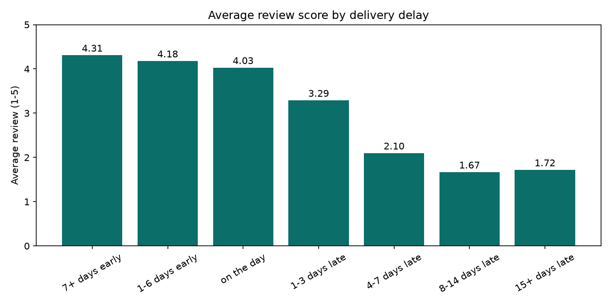
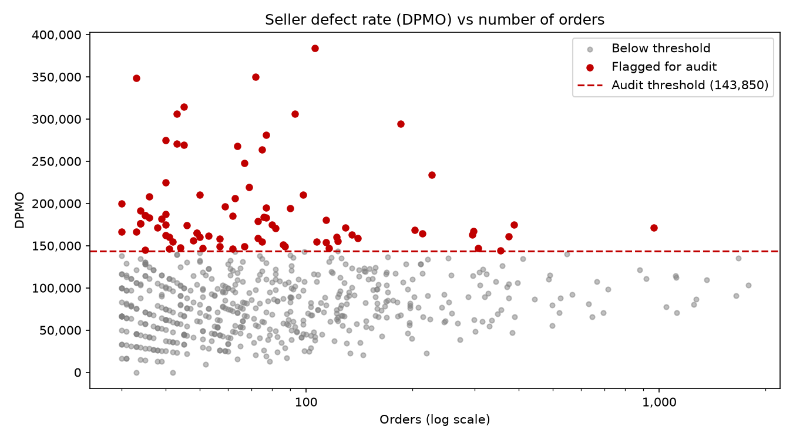

# Olist Delivery KPIs & Seller Defect Rate (Python)

An end-to-end analysis of **96,447 delivered orders** from a Brazilian online marketplace: data quality checks, table joins with row-count control, delivery KPIs, the link between late delivery and customer reviews, and a **DPMO-style defect rate per seller** with an audit list. One command runs the whole pipeline and builds an **Excel report with charts**.

**Tools:** Python · pandas · matplotlib · openpyxl
**Data:** [Brazilian E-Commerce Public Dataset by Olist](https://www.kaggle.com/datasets/olistbr/brazilian-ecommerce) (Kaggle, 2016–2018)

> **About this project:** my background is SQL (Amazon Redshift), Excel/VBA and Power BI. This is my first Python project. I built it step by step to move my day-to-day analysis methods into Python, including a defect-rate (DPMO) approach I used in operations.

---

## Key findings

| | |
|---|---|
| **93.2%** of orders arrive on time | Late orders are late by **10.6 days** on average |
| On-time orders arrive **13.5 days early** on average | The promised delivery date is very cautious |
| Late orders get an average review of **2.27** vs **4.29** | **62%** of late orders get a 1–2 star review (vs 9% on time) |
| Late orders are **6.7%** of rated orders | …but cause **32.5%** of all bad reviews, about **5x** their share |
| Worst months: **Nov 2017** (Black Friday, 12.4% late) and **Feb–Mar 2018** (14.1% and 19.0%) | From Apr 2018 late rate and delivery time both improve |
| North-east states are worst (**MA 17.4%**, CE 13.8%, BA 12.2%) | **RJ** is an outlier: 12.1% late with only 14.8 days delivery, so distance alone does not explain it |
| **83 of 615** sellers flagged for audit | They cause **20%** of defects: seller audits help, but most defects need system-level fixes |

---

## Project walkthrough

This section shows the whole project from raw files to the final report: what each step does, why, and what it found.

### Step 1 · First look at the data
**Goal:** know the data before analysing it.
Each table is loaded, then I check its size, the first rows, missing values and whether key columns are unique.

**What I found:**
- 99,441 orders, but 112,650 order items: one order can have several products.
- 2,965 orders have no delivery date.
- **551 duplicate `order_id` values in reviews:** some orders have more than one review. A direct join would duplicate orders and make every KPI wrong.

### Step 2 · Data quality checks
**Goal:** find data that is wrong or contradicts itself, and decide what to do with it.
Dates are turned into real dates, then every check that should return zero is counted and saved to a quality log (it becomes a sheet in the final report).

| Finding | Rows | Decision |
|---|---|---|
| Orders not delivered (shipped, canceled, …) | ~2,960 | Left out of delivery KPIs: they cannot be on time or late |
| Status "delivered" but no delivery date | 8 | Left out |
| Given to the carrier **after** reaching the customer | 23 | Left out: impossible order of dates |
| Orders with more than one review | 547 | Kept the **latest** review |
| Orders with more than one seller | 1,278 | Kept in delivery KPIs; **left out of the seller score**, because one delivery date cannot be split between sellers |
| Price ≤ 0, review score outside 1–5, delivered before purchase | 0 | Clean |

### Step 3 · Joining the tables safely
**Goal:** one clean table with one row per order, plus one table with one row per order and seller.

Every join uses `validate=` (the program stops if a key is not unique) and the row count is printed before and after:

```python
base = base.merge(
    reviews_one[["order_id", "review_score"]],
    on="order_id", how="left", validate="one_to_one",
)
```
```
orders + customers       96,447 ->   96,447   OK
orders + reviews         96,447 ->   96,447   OK
```
Row check: 96,478 delivered − 8 − 23 = **96,447** orders in the analysis.

**Late** means delivered on a later **day** than the estimated date. The time of day is ignored, because the estimate has no time.

### Step 4 · Delivery KPIs
**Goal:** how good is delivery overall, where is it worst, and is it getting better?
KPIs are calculated overall, by customer state, by month and by seller. Groups that are too small are not ranked (states: 500+ orders, sellers: 30+ orders), because small groups give unstable percentages.





### Step 5 · Do late deliveries hurt reviews?
**Goal:** show the business cost of a late delivery.
Delays are grouped into ranges with `pd.cut`. The review score falls **step by step** as the delay grows: 4.31 → 4.18 → 4.03 → 3.29 → 2.10 → 1.67.



This is a strong link, not proof of cause: a bad review can also be about the product.

### Step 6 · Seller defect rate (DPMO) and audit list
**Goal:** find the sellers who need an audit, and decide the order of audits.

- Only single-seller orders are used, so we know who is responsible.
- Each order has **2 opportunities** for a defect: late delivery, and a bad review (1–2 stars, if the customer left one).
- `DPMO = defects / opportunities × 1,000,000`
- **Network DPMO (95,900)** = all defects ÷ all opportunities. **Not** the average of seller DPMOs, because a seller with 30 orders must not count as much as one with 1,000.
- **Audit flag:** seller DPMO above **1.5 × network (143,850)** and at least **30 orders**.
- **Audit order:** by **excess defects** = seller defects minus the defects expected at the network rate for that seller's volume. This sends the audit where it removes the most problems, not just to the highest rate.



The chart has a funnel shape: small sellers vary much more by chance. The seller with ~960 orders does not have the highest DPMO, but has the most excess defects (144.9), so it is **priority 1**.

### Step 7 · Charts
Four charts are saved as PNG files with titles, axis labels and reference lines (average late rate, audit threshold).

### Step 8 · Automatic Excel report
**Goal:** a report a manager can open without Python.
`pandas` writes one table per sheet; `openpyxl` adds titles, header colours, column widths, frozen headers, number formats and the charts.

| Sheet | Content |
|---|---|
| Summary | Delivery KPIs and seller KPIs |
| Monthly | Late rate and delivery time by month + chart |
| States | Late rate by state + chart |
| Reviews | Review score by delay + chart |
| Audit list | 83 flagged sellers in priority order + chart |
| Data quality | The quality log from step 2 |

### Step 9 · One command runs everything
`run_all.py` runs steps 2–8 in order. If a step fails, the pipeline stops (`check=True`), so the report is never built on wrong data.

---

## Project structure

```
olist-delivery-kpi/
├── data/raw/                  ← Kaggle CSV files (not in the repo, download them)
├── src/
│   ├── load_data.py           ← shared code: read CSV files, turn date columns into dates
│   ├── 01_load_and_check.py   ← first look
│   ├── 02_quality_checks.py
│   ├── 03_join_tables.py
│   ├── 04_delivery_kpis.py
│   ├── 05_review_impact.py
│   ├── 06_seller_dpmo.py
│   ├── 07_charts.py
│   └── 08_excel_report.py
├── output/                    ← KPI tables, charts and the Excel report
├── docs/                      ← screenshots for this README
├── run_all.py
└── requirements.txt
```

## How to run

```
python -m venv .venv
.venv\Scripts\activate          (Mac/Linux: source .venv/bin/activate)
pip install -r requirements.txt
```
Download the dataset from Kaggle and put the CSV files in `data/raw/`, then:
```
python run_all.py
```

## Limits

- The link between delay and reviews is strong and step by step, but it is a link, not proof of cause.
- Small sellers vary more by chance. A flag should be confirmed in a second period before an audit.
- The data does not explain the Feb–Mar 2018 peak: that is a question for the logistics team, not a conclusion.
- The estimated delivery date is set by the marketplace, so "late" measures the promise as much as the delivery.

## What I would do next

- Confirm audit flags over two periods before sending an auditor
- Add the cost of a bad review (e.g. lost repeat orders) to show the money behind the KPIs
- Compare the promised delivery time by state to find where the estimate is too short
